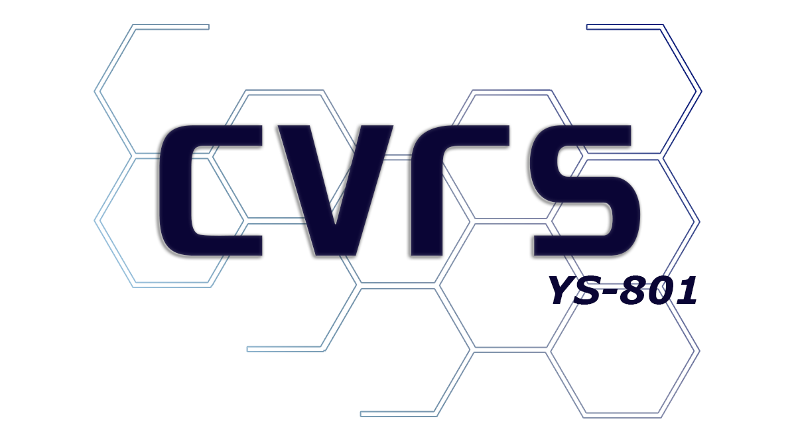
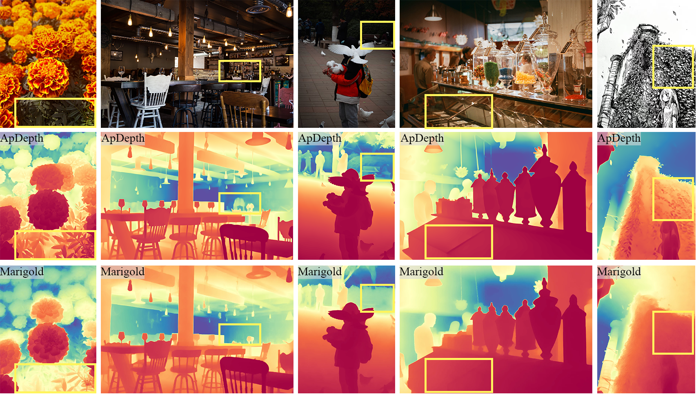

## 🍀About me 
<!-- completed my undergraduate studies at the [**University of Emergency Management**](https://uem.ncist.edu.cn/), and I am  -->
Come from **Taiyuan, Shanxi, China**, currently pursuing a master's degree in computer science at [**ShenYang Jianzhu University**](https://www.sjzu.edu.cn/), supervised by [**Prof.Yuanshuai**](https://syjz.teacher.360eol.com/teacherBasic/preview?teacherId=23776). For now, my primary research focuses on fine-tuning diffusion models for deep estimation tasks. 

I used to participate in many **ACM algorithm** competitions(***2022-2023***), but have now retired. In my daily life, I enjoy reading and photography. You can view my photography collection in the [**Gallery**](https://haruko386.github.io/gallery/). I'm also a Golang backend developer. Feel free to communicate with me about <u><i>CV</i></u> and <u><i>Golang</i></u>

-------------------------
<table width="100%" align="center" border="0" cellspacing="0" cellpadding="20" style="border: 0;">
      <tbody><tr>
        <td width="20%" valign="middle" style="text-align: center;"> 
          
        </td>
        <td width="20%" valign="middle" style="text-align: center;">
          
        </td>
        <td width="20%" valign="middle" style="text-align: center;"> 
          
        </td>
        <td width="20%" valign="middle" style="text-align: center;"> 
          
        </td>
        <td width="20%" valign="middle" style="text-align: center;">
          
        </td>
      </tr></tbody>
</table>

## 📝 Publications 

TMM 2026

[**ApDepth: Aiming for Precise Monocular Depth Estimation Based on Diffusion Models**](https://haruko386.github.io/research/)

\[[**Website**](https://haruko386.github.io/research/)\] \[[Paper](https://haruko386.github.io/research/article.pdf)\] \[[Demo](https://huggingface.co/spaces/developy/ApDepth)\] \[[Model](https://huggingface.co/developy/ApDepth)\] 

This paper presents ApDepth, a novel single-step diffusion framework for monocular depth estimation that achieves fast inference while preserving fine-grained edge details through a tailored two-stage training strategy combined with novel frequency-domain and cosine similarity losses.

TCSVT 2026

[**ApDepth-G: Mitigating Pseudo-Texture Artifacts in Diffusion-Based Models**](https://haruko386.github.io/ApDepth-G)

\[[**Website**](https://haruko386.github.io/ApDepth-G/)\] \[[~~Paper~~](#)\] \[[Model](https://huggingface.co/developy/ApDepth-G)\] 

We presents ApDepth-G,  a multi-step geometric diffusion refinement framework for sky-stable monocular depth estimation. It progressively refines latent depth representations through multi-step denoising and improves training with offset noise regularization, SNR-based loss reweighting, and latent gradient consistency.

## 🎈ACM ＆ OI

**ACM** Algorithm Competition participant, primarily competing in online contests on platforms such as **Leetcode**, **Atcoder**, and **Codeforces**. Historical ratings on each platform are available [here](https://clist.by/coder/Developly/). 

   

## 🏆Speedrun

I have participated in many speedrun competitions, mainly working on the **Hollow Knight** IL project, and have achieved top 30 worldwide rankings in each of them, even winning a **WR** in one of them and a **fourth** place in another.

   
   

      WR on Hollow Knight Trial of the Warrior
   

